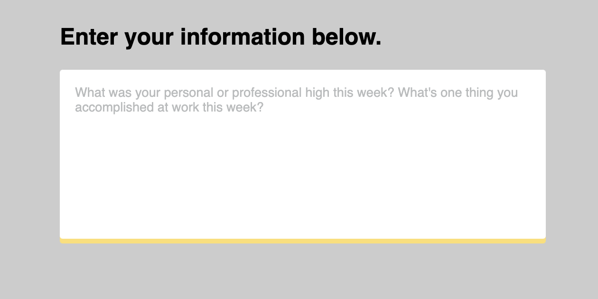
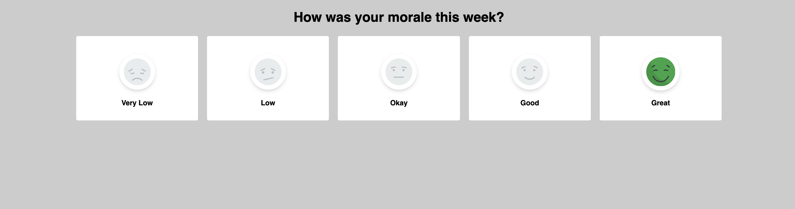

# Niko's Contributions

Here are a couple snippets that can make for some cleaner and more modern radio
and textarea input fields:

## React in WordPress

This is just some information about how to use `@wordpress/scripts` to set up a
React App within a WordPress Gutenberg Block.

[Guide](guides/react-in-wordpress)

## TailwindCSS in WordPress

This is a guide on how to use Vite to add TailwindCSS to a WordPress theme.

[Guide](guides/tailwind-in-wordpress)

## Label within textarea

This is a textarea with a label that looks like it sits within it. When the
textarea is active, the label moves up and out of the way and a yellow shadow
appears on the bottom.

[Source](components/label-within-textarea)

## Stylized radio buttons

These are radio buttons stylized with images that change when selected.

[Source](components/stylized-radio-buttons)
